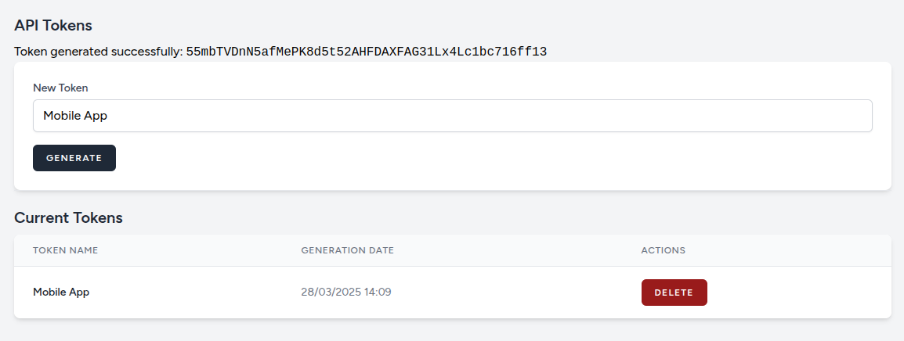

# Livewire Sanctum Token Manager
[](https://packagist.org/packages/yuloma/sanctum-token-manager) [](https://packagist.org/packages/yuloma/sanctum-token-manager) [](https://packagist.org/packages/yuloma/sanctum-token-manager) [](https://packagist.org/packages/yuloma/sanctum-token-manager) [](https://packagist.org/packages/yuloma/sanctum-token-manager)

This library aims to simplify the Sanctum token management process, with a pre-defined interface ready to use with Livewire.



## Install

```
composer required yuloma/sanctum-token-manager
```

## Usage

By default you only have to access to `/tokens` URI. This route is protected by middlewares `['web', 'auth']`.

If you want a diferent route, you only have to add it in your `routes.php` file.

## Publish config

`php artisan vendor:publish --tag=sanctum-token-manager-config`

## Publish views

`php artisan vendor:publish --tag=sanctum-token-manager-views`

## Custom Layout
After publishing the config you can tweak it.

`config/sanctum-token-manager.php`

```
[
    'livewire_layout' => 'my-layout'
]
```

## Security
If you discover any security-related issues, create an issue using the issue tracker.

## License
The MIT License (MIT).
